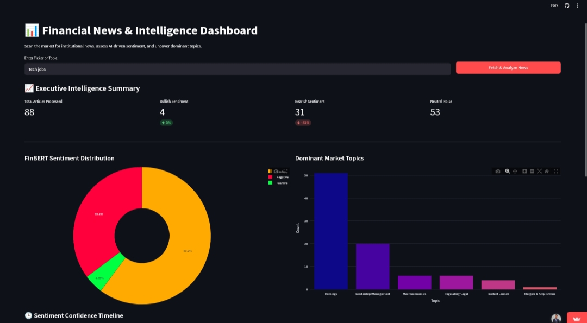

<div align="center">

<!-- BANNER IMAGE -->


<br/>
<br/>

# 🤖 MarketPulse AI

### *Real-Time Financial Intelligence Platform*

> **"Bloomberg Terminal for the everyday investor — powered by open-source LLMs."**

<br/>

<!-- BADGES -->


<br/>

<!-- CTA BUTTONS -->
[](https://market-sentiment-analyser-ravikumar-3481.streamlit.app/)
&nbsp;
[](MarketPulse_AI_Project_Report.pdf)

</div>

---

## 📌 Table of Contents

- [Overview](#-overview)
- [Problem Statement](#-problem-statement)
- [Solution](#-solution--the-marketpulse-ecosystem)
- [Key Features](#-key-features)
- [Tech Stack](#-tech-stack)
- [Screenshots](#-screenshots)
- [Project Architecture](#-project-architecture)
- [How to Clone & Run](#-how-to-clone--run-locally)
- [Usage Guide](#-usage-guide)
- [Connect with Me](#-connect-with-me)

---

## 🧠 Overview

**MarketPulse AI** is a sophisticated, full-stack AI platform that transforms the chaotic noise of global financial news into **structured, real-time, and actionable insights**.

Unlike standard news aggregators, MarketPulse AI uses an **ensemble of Deep Learning Transformers** to read, categorize, and sentiment-score financial data — providing a holistic *"Pulse"* of the market by merging:

- 📰 **Institutional News** (Google News RSS)
- 💬 **Retail Social Sentiment** (Reddit r/WallStreetBets)
- 📈 **Live Technical Price Action** (yfinance candlestick charts)

The core philosophy is **Cognitive Efficiency** — automating the *Read → Analyze → Correlate → Decide* workflow so users can focus on **strategy, not data entry.**

---

## ⚡ Problem Statement

In the modern financial landscape, traders and analysts face **three critical barriers:**

| # | Problem | Description |
|---|---------|-------------|
| 1 | **The Velocity Crisis** | Over 2.5 quintillion bytes of data are produced daily. No human can read and categorize every market-moving headline in real time. |
| 2 | **The Context Trap** | Generic AI misreads financial language. *"Interest rate cut"* gets flagged as negative because of the word *"cut"* — even though it's a bullish catalyst. Financial NLP needs domain-specific training. |
| 3 | **Fragmented Intelligence** | Investors juggle Bloomberg, Reddit, and TradingView simultaneously — causing *context-switching fatigue* and delayed decisions during fast-moving markets. |

---

## ✅ Solution — The MarketPulse Ecosystem

MarketPulse AI solves all three problems through a **Centralized Intelligence Pipeline:**

```
📡 Data Ingestion  →  🧹 Cleaning  →  🤖 NLP Analysis  →  📊 Visualization
```

- **🔄 Automated Ingestion** — Scrapes and parses live news from Google News RSS + Reddit WallStreetBets continuously.
- **🧠 Context-Aware NLP** — Uses **FinBERT**, pre-trained on SEC filings and analyst reports, for finance-accurate sentiment — not generic word matching.
- **📝 Cognitive Summarization** — **DistilBART** condenses 2,000-word articles into TL;DR highlights in seconds.
- **📊 Unified Dashboard** — Maps sentiment scores and social buzz directly against **live yfinance candlestick charts** to reveal real-time news-price correlation.
- **🏷️ Zero-Shot Topic Classification** — **DistilBERT-MNLI** auto-tags articles as *Earnings, M&A, Leadership, or Macro* without any labeled training data.

> 💡 **Lazy-Loading Architecture:** All 4 Transformer models are loaded *on-demand* — not at startup. This keeps the app lightweight, fast, and mobile-friendly while running 4 heavy AI models in a single browser session.

---

## 🎯 Key Features

| Feature | Description |
|---------|-------------|
| 📰 **Global News Scraping** | Fetches live headlines for any keyword (e.g., `TSLA`, `Inflation`, `Fed Rate`) |
| 📊 **AI Sentiment Mapping** | FinBERT classifies news mood as 🟢 Bullish / 🔴 Bearish / ⚪ Neutral with confidence scores |
| 🏷️ **Auto Topic Classification** | Zero-shot tagging: Earnings · M&A · Leadership · Macro |
| 💬 **Reddit Social Sentiment** | Scrapes r/WallStreetBets to quantify retail investor hype |
| 📈 **Live Stock Charting** | 30-day candlestick charts with moving averages via yfinance |
| 🔍 **Deep-Dive Analysis** | Full article summarization + named entity extraction in one click |

---

## 🛠️ Tech Stack

```
┌─────────────────────────────────────────────────────────┐
│                   MarketPulse AI Stack                  │
├──────────────────┬──────────────────────────────────────┤
│ Web Framework    │ Streamlit                            │          
│ Data Ingestion   │ BeautifulSoup4 · Feedparser ·        │
│                  │ Requests                             │
│ Financial Data   │ yfinance                             │
│ NLP – Sentiment  │ FinBERT (ProsusAI)                   │
│ NLP – Summary    │ DistilBART (facebook/bart-large-cnn) │
│ NLP – Entities   │ BERT-Base-NER                        │
│ NLP – Topics     │ DistilBERT-MNLI                      │
│ Data Science     │ Pandas · NumPy · PyTorch             │
│ Visualization    │ Plotly                               │
└──────────────────┴──────────────────────────────────────┘
```

---

## 📸 Screenshots

<div align="center">

### 🏠 Home — ML Pipeline Overview


<br/>

### 📊 Dashboard — Sentiment Analysis


<br/>

### 📈 Market Data — Live Stock Chart


<br/>

### 🔍 Deep-Dive Analysis


</div>

---

## 🏗️ Project Architecture & workflow

```
MarketPulse AI
│
├── 📡 Stage 01 — Data Ingestion
│     └── RSS Feedparser + BeautifulSoup → live news & Reddit posts
│
├── 🧹 Stage 02 — Data Cleaning
│     └── Pandas pipeline → normalize, deduplicate, structure
│
├── 🤖 Stage 03 — Sentiment Engine
│     └── FinBERT → Bullish / Bearish / Neutral + confidence score
│
├── 🏷️ Stage 04 — Topic Classifier
│     └── DistilBERT-MNLI → Earnings / M&A / Leadership / Macro
│
├── 📝 Stage 05 — Summarizer
│     └── DistilBART → concise TL;DR from long articles
│
├── 🔍 Stage 06 — Entity Extractor
│     └── BERT-NER → key companies, people, locations
│
├── 💹 Stage 07 — Price Correlation
│     └── yfinance → OHLCV data overlaid with sentiment timeline
│
└── 📊 Stage 08 — Visualization
      └── Plotly + Streamlit → interactive charts & live UI
```

---

## 🚀 How to Clone & Run Locally

### Prerequisites

- Python 3.10 or higher
- pip package manager
- Git

### Steps

```bash
# 1. Clone the repository
git clone https://github.com/ravikumar-3481/market-sentiment-analyser.git

# 2. Navigate into the project folder
cd market-sentiment-analyser

# 3. Create and activate a virtual environment
python -m venv venv

# On Windows
venv\Scripts\activate

# On macOS/Linux
source venv/bin/activate

# 4. Install all dependencies
pip install -r requirements.txt

# 5. Run the Streamlit app
streamlit run app.py
```

> 🌐 The app will open automatically at `http://localhost:8501`

### requirements.txt includes:
```
streamlit
beautifulsoup4
feedparser
requests
yfinance
transformers
torch
pandas
numpy
plotly
praw
```

---

## 📖 Usage Guide

| Page | What to Do |
|------|------------|
| **🏠 Home** | Review the project architecture and ML pipeline overview |
| **📊 Dashboard** | Enter a ticker (e.g., `NVDA`) → click *Fetch & Analyze* → view sentiment charts & topic distribution |
| **📈 Market Data** | Enter a ticker → view 30-day live candlestick chart + Reddit Social Pulse comparison |
| **📰 Scraped Articles** | Browse live headlines → click *Deep Dive Analysis* to trigger AI summarizer + entity extractor |
| **👤 About** | Explore developer profile and full technical system design |

---

## 🤝 Connect with Me

<div align="center">

[](https://github.com/ravikumar-3481)
&nbsp;
[](https://www.linkedin.com/in/ravi-vishwakarma67)
&nbsp;
[](https://x.com/your-handle)
&nbsp;
[](https://instagram.com/your-handle)
&nbsp;
[](mailto:ravivish968@gmail.com)

</div>

---

## 📄 License

This project is licensed under the **MIT License** — see the [LICENSE](LICENSE) file for details.

---

<div align="center">

*Built with ❤️ by **Ravi Vishwakarma***

⭐ **If you found this useful, please star the repo!** ⭐

</div>
